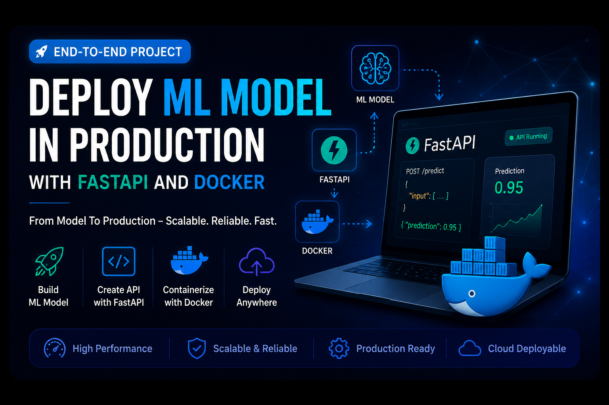

# 🚀 Deploy ML Models in Production with FastAPI & Docker

---
Welcome to **Deploy ML Models in Production with FastAPI & Docker**, a comprehensive hands-on course created by **Uditya Narayan Tiwari** to help learners master the complete Machine Learning deployment lifecycle. This repository is designed to bridge the gap between building machine learning models and deploying them as scalable, production-ready applications.

Throughout this course, you'll learn how to expose trained machine learning models as high-performance REST APIs using **FastAPI**, containerize applications with **Docker**, and follow industry-standard deployment practices. Each module focuses on practical implementation, ensuring you gain real-world experience through structured examples and end-to-end projects.

Whether you're a student, Machine Learning Engineer, Data Scientist, or AI enthusiast, this repository will equip you with the skills required to build reliable, scalable, and production-ready ML services that can be deployed locally or on cloud platforms.

## 🎯 What You'll Learn

* Build production-ready Machine Learning APIs using FastAPI
* Serialize and serve trained ML models efficiently
* Design clean, scalable, and maintainable REST APIs
* Containerize applications with Docker
* Manage dependencies and reproducible environments
* Test and debug ML APIs
* Organize production-grade ML project structures
* Prepare applications for deployment on AWS, Azure, GCP, Render, and other cloud platforms

By the end of this course, you'll have the knowledge and practical experience to deploy machine learning models confidently and integrate them into real-world web, mobile, and enterprise applications.

---

## 👨‍💻 Author

**Uditya Narayan Tiwari**
B.Tech (CSE - AI & ML) | Machine Learning & Generative AI Enthusiast

- 🌐 [My Portfolio](https://udityanarayantiwari.netlify.app/)

- 💼 [My LinkedIn](https://www.linkedin.com/in/uditya-narayan-tiwari-562332289/)

- 📧 [Email Id](https://uditmerit@gmail.com)